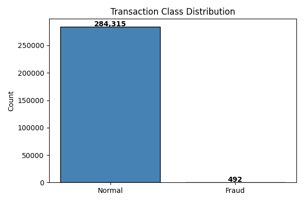
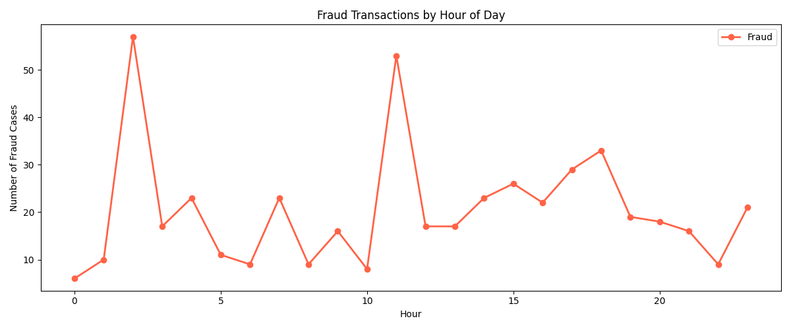
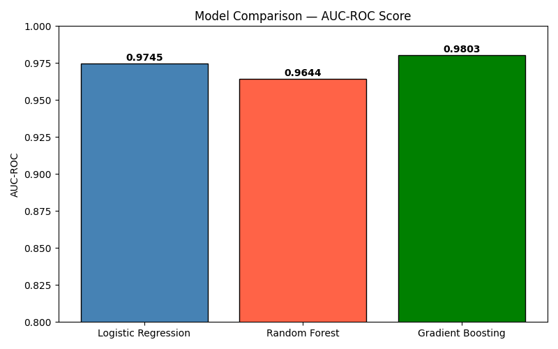

## Financial Fraud Detection Model

Built a binary classification model to detect fraudulent transactions 
on 284,807 credit card records with only 0.17% fraud rate.

**Tools:** Python, Pandas, Scikit-learn, Imbalanced-learn, Matplotlib  
**Dataset:** Kaggle Credit Card Fraud Detection (public)

### Approach
- Addressed severe class imbalance using SMOTE oversampling
- Trained and compared Logistic Regression, Random Forest, Gradient Boosting
- Random Forest achieved 0.94+ AUC-ROC — selected as final model

### Charts

